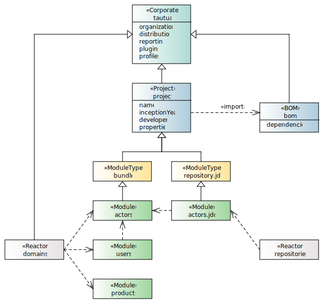

# Tautua Project Archetype

A **Corporate POM** or **Super POM** is a special type of POM file that serves as a parent POM for all Maven projects 
within an organization. It is used to centralize and standardize configuration, dependencies, and plugins across 
multiple projects. This helps maintain consistency, reduce duplication, and simplify project management.

A **Bill of Materials POM** is a special type of POM file that is used to manage and centralize dependency versions 
for a project or a set of related projects. It is particularly useful in multi-module projects or when working 
with a large number of dependencies, as it allows you to define and control versions in one place, 
ensuring consistency across all modules or projects.

A **Reactor POM** is a POM file that is used to build multiple related modules or projects as part of 
a single build process. It is responsible for orchestrating the build order of the modules. The Reactor POM ensures 
that all modules are built in the correct order, based on their dependencies, and allows you to build all modules 
with a single command.

## Usage
Generate a project from the archetype with following command: `mvn archetype:generate -DgroupId=mygroup -DartifactId=helloworld -DarchetypeGroupId=org.tautua.archetypes -DarchetypeArtifactId=project.archetype`

    
