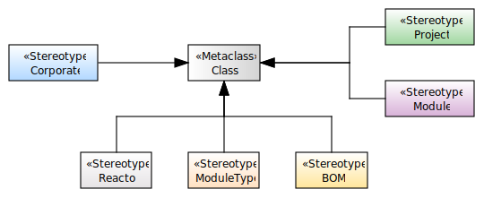
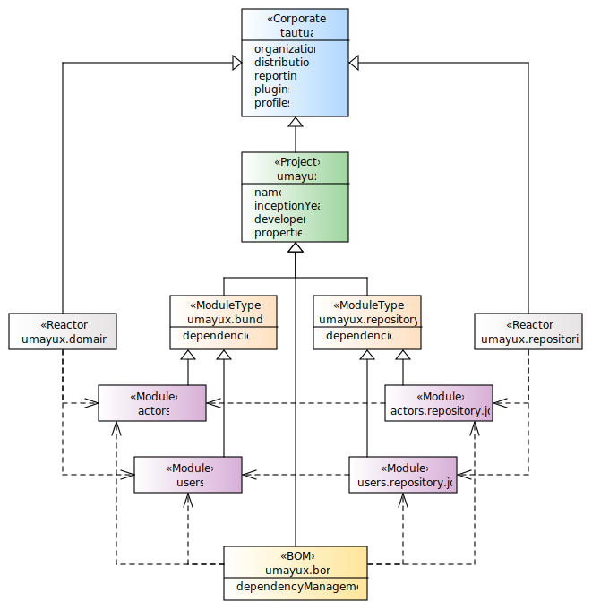
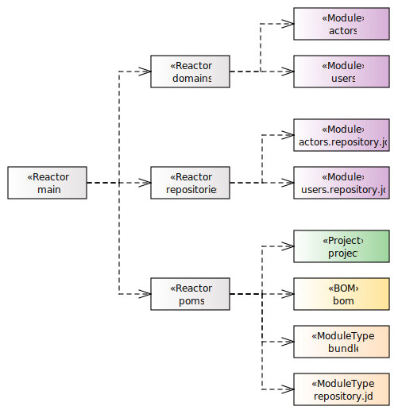

# Tautua Project Archetype

This Maven archetype is designed to generate a standardized multi-module project structure that adheres to best 
practices for modularity, dependency management, and build consistency. The generated project follows a well-defined 
hierarchy and leverages key Maven concepts such as Corporate POMs, Bill of Materials (BOM), Reactor POMs, 
and module types to ensure scalability, maintainability, and reusability.

This archetype is ideal for teams and organizations looking to standardize their Maven projects while maintaining flexibility and scalability.

## Key features



A **Corporate POM** or **Super POM** is a special type of POM file that serves as a parent POM for all Maven projects 
within an organization. It is used to centralize and standardize configuration, dependencies, and plugins across 
multiple projects. This helps maintain consistency, reduce duplication, and simplify project management.

A **Bill of Materials POM** is a special type of POM file that is used to manage and centralize dependency versions 
for a project or a set of related projects. It is particularly useful in multi-module projects or when working 
with a large number of dependencies, as it allows you to define and control versions in one place, 
ensuring consistency across all modules or projects.

A **Reactor POMs** is a POM file that is used to build multiple related modules or projects as part of 
a single build process. It is responsible for orchestrating the build order of the modules. The Reactor POM ensures 
that all modules are built in the correct order, based on their dependencies, and allows you to build all modules 
with a single command.

A **Project POM** (TODO)

A **ModuleType POM** provides predefined module templates for common use cases, ensuring consistency in module 
structure and configuration. For example a template for a Domain module, or a RestService module.

A **Module** These are a specific module implementation of a domain, utility libs, etc. 

## Usage
To generate a project using this archetype, run the following Maven command:

```bash
mvn archetype:generate \
  -DarchetypeGroupId=org.tautua.archetypes \
  -DarchetypeArtifactId=project.archetype \
  -DarchetypeVersion=<USE_LATEST_VERSION> \
  -DgroupId=<your-groupId> \
  -DartifactId=<your-artifactId> \
  -Dversion=<your-version>
```



This archetype generate a filesystem layout.



## Contributing
Contributions are welcome! If you'd like to contribute to this archetype, please:

1. Fork the repository.
2. Create a new branch for your changes.
3. Submit a pull request with a detailed description of your changes.

For bug reports or feature requests, please open an issue on GitHub.
